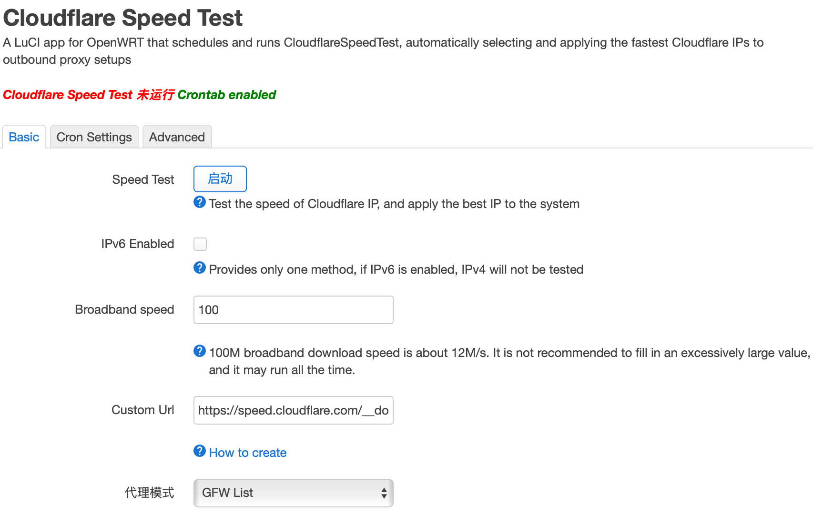
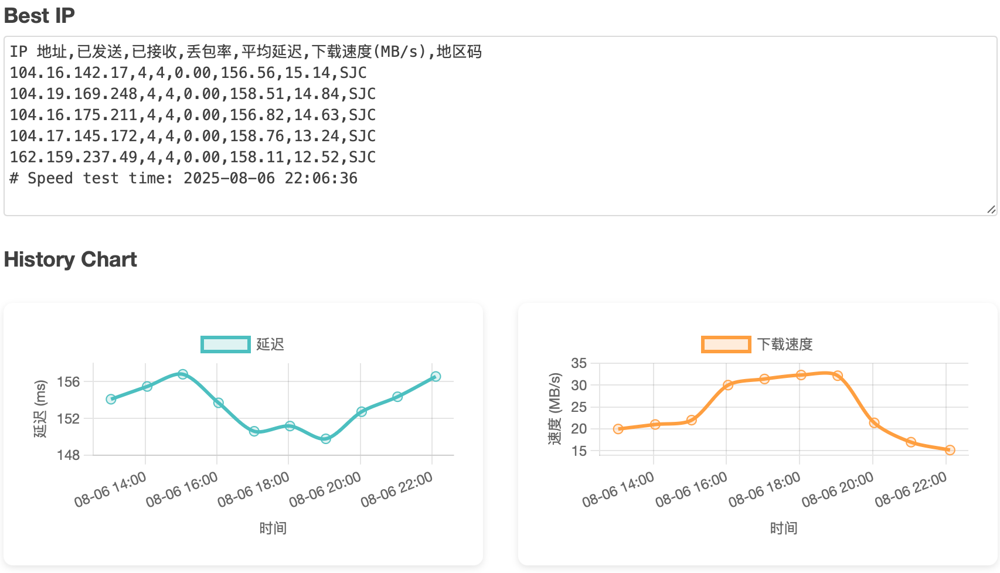

# luci-app-cloudflarespeedtest

[](https://github.com/stevenjoezhang/luci-app-cloudflarespeedtest/actions/workflows/build.yml)
[](https://github.com/stevenjoezhang/luci-app-cloudflarespeedtest/releases)

[中文说明](README.CN.md)

**luci-app-cloudflarespeedtest** is a LuCI application for OpenWrt, based on the [CloudflareSpeedTest](https://github.com/XIU2/CloudflareSpeedTest) core tool. It automatically tests the latency and download speed of Cloudflare IPs, selects the best ones for your network, and updates them to proxy plugins like SSR+ and Passwall.

This project is a fork of [mingxiaoyu/luci-app-cloudflarespeedtest](https://github.com/mingxiaoyu/luci-app-cloudflarespeedtest) with significant refactoring and improvements.

## Features

*   **Auto Speed Test**: Periodically or manually test Cloudflare IPs to find the best one.
*   **Proxy Integration**: Automatically update the best IP to SSR+, Passwall, and other proxy tools.
*   **Visual Charts**: View history charts for latency and download speed trends.
*   **Auto Core Download**: The package does not contain the core binary; it downloads automatically on the first run, reducing the package size.
*   **Improved UI & Logs**: Redesigned status display and log format for better readability.

## Installation

1.  Download the latest `.ipk` or `.apk` file from [Releases](https://github.com/stevenjoezhang/luci-app-cloudflarespeedtest/releases).
2.  Install it on your router:
    ```bash
    opkg install luci-app-cloudflarespeedtest_*.ipk
    ```
3.  Go to LuCI -> Services -> CloudflareSpeedTest to configure.

## Screenshots




## Build

```bash
# Compile package only
make package/luci-app-cloudflarespeedtest/compile V=99

# Compile full image
make menuconfig
#choose LuCI ---> 3. Applications  ---> <*> luci-app-cloudflarespeedtest..... for LuCI ----> save
make V=99
```

## Acknowledgements

*   [CloudflareSpeedTest](https://github.com/XIU2/CloudflareSpeedTest)
*   [mingxiaoyu/luci-app-cloudflarespeedtest](https://github.com/mingxiaoyu/luci-app-cloudflarespeedtest)
