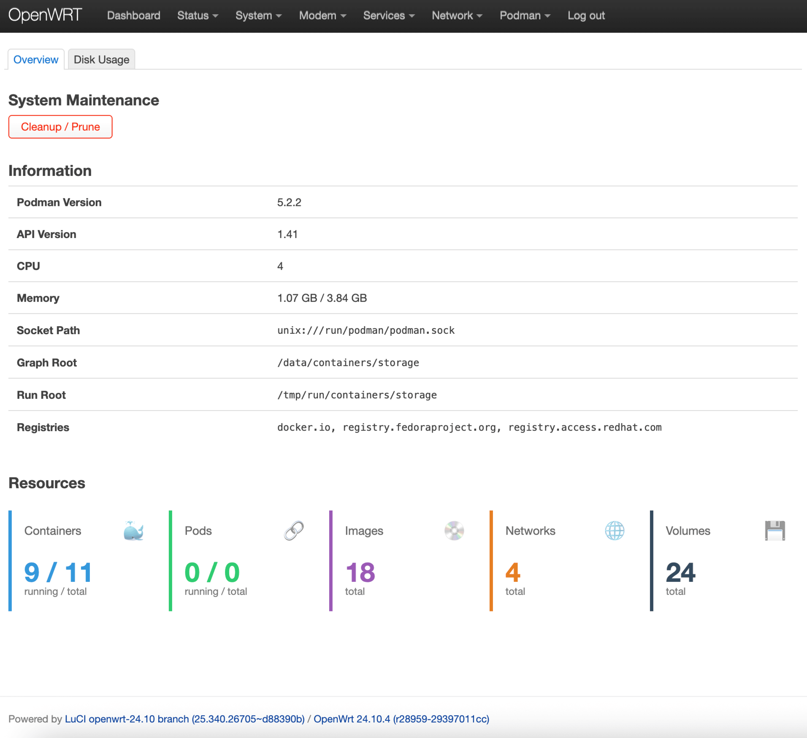
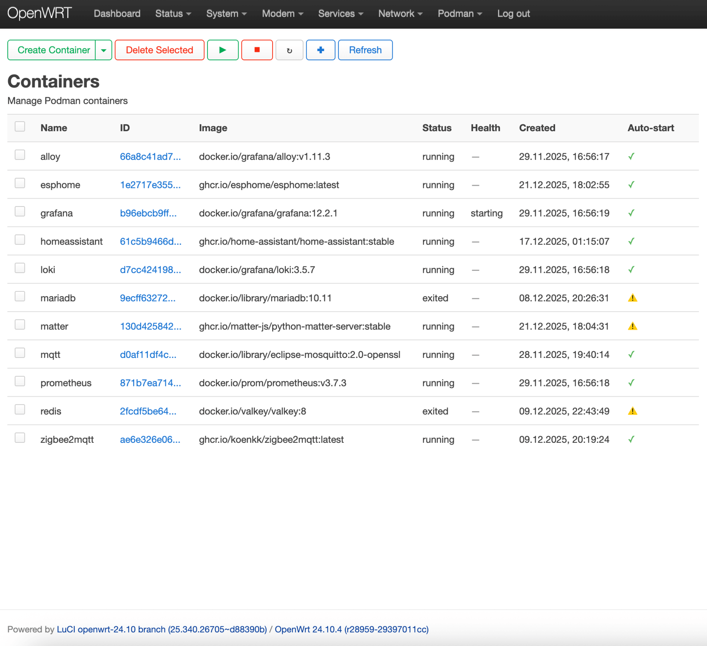
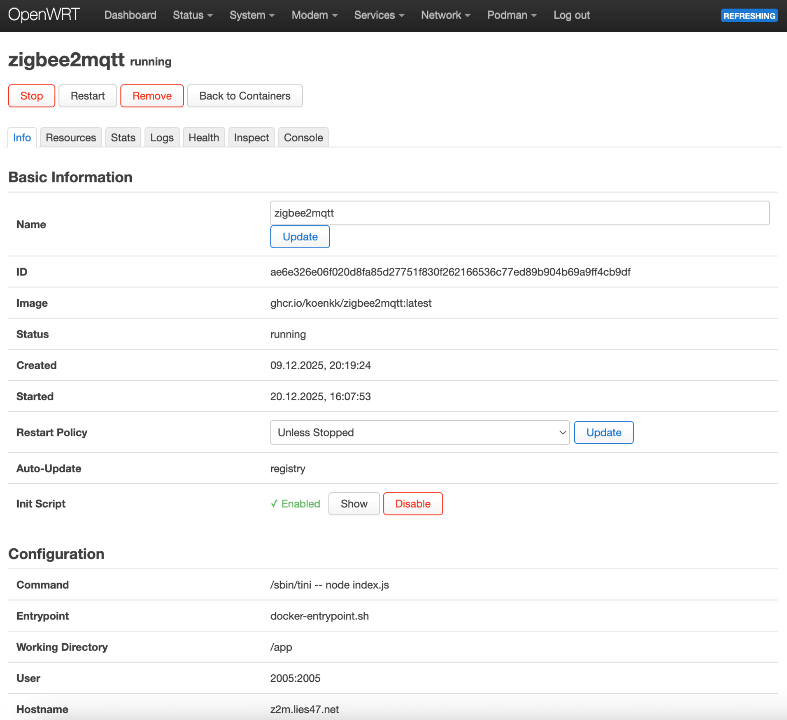
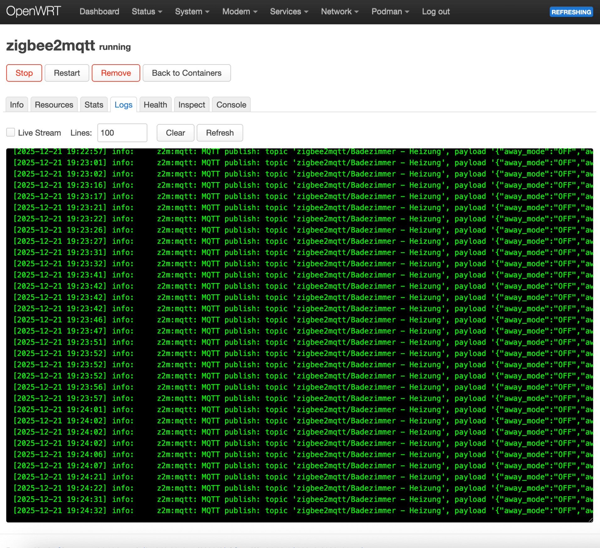
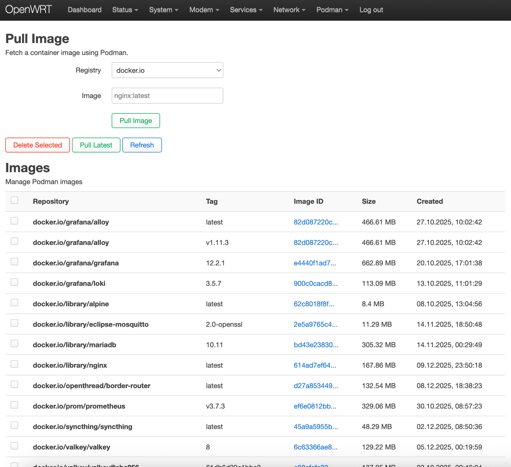
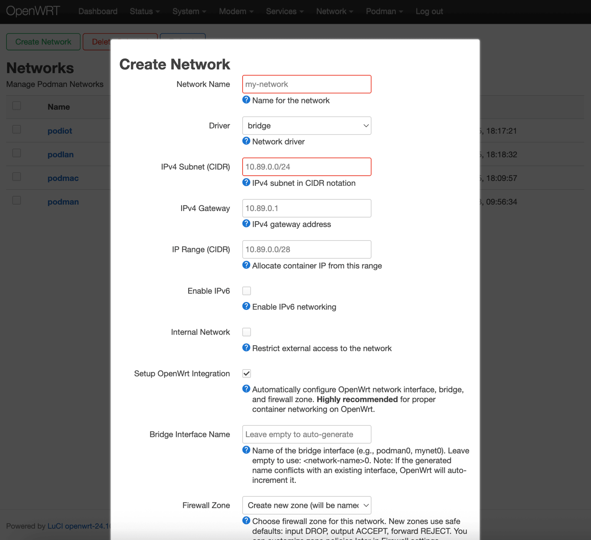

[](https://openwrt.org/)
[](https://github.com/Zerogiven-OpenWRT-Packages/luci-app-podman/releases)
[](https://github.com/Zerogiven-OpenWRT-Packages/luci-app-podman/issues)
<!-- [](https://github.com/Zerogiven-OpenWRT-Packages/luci-app-podman/releases) -->

# LuCI App Podman

Modern and feature rich LuCI web interface for managing Podman on OpenWrt. Some ideas which may come in one of the next version(s) can you find in the [todo's](./docs/TODO.md) file. Also feel free to open a ticket or send me a mail if you have suggestions, ideas or problems 🙂

<details>

<summary>Navigation</summary>

- [Features](#features)
- [Screenshots](#screenshots)
- [Requirements](#requirements)
- [Installation](#installation)
- [Usage](#usage)
- [Container Auto-Update](#container-auto-update)
- [Container Auto-Start](#container-auto-start)
- [Configuration](#configuration)
- [Credits](#credits)

</details>

## Features

- **Container Management**: Start, stop, restart, create, remove containers
- **Live Streaming**: Real-time logs, stats, and process list streamed directly via a dedicated ucode controller
- **Container Auto-Update**: Check for image updates and recreate containers with latest images (see [Auto-Update](#container-auto-update))
- **Auto-start Support**: Automatic init script generation for containers with restart policies
- **Image Management**: Pull, remove, inspect images with streaming progress
- **Volume Management**: Create, delete, export/import volumes with tar backups
- **Network Management**: Bridge, macvlan, ipvlan with VLAN support and optional OpenWrt integration (auto-creates bridge devices, network interfaces, dnsmasq exclusion, and shared `podman` firewall zone with DNS access rules)
- **Pod Management**: Create pods with shared namespaces, lifecycle actions (start/stop/restart/pause/unpause), and add containers to existing pods directly from the create form
- **Secret Management**: Encrypted storage for sensitive data
- **System Overview**: Resource usage, system-wide cleanup
- **Multilingual**: de, es, fr, nl, ru, zh_Hans, zh_Hant

## Screenshots

| Overview | Container List | Container Info |
|---|---|---|
|  |  |  |

| Live Logs | Image List | Network Create |
|---|---|---|
|  |  |  |

## Requirements

- OpenWrt 25.12 / 24.10
- Dependencies:
  - `podman`
  - `luci-base`
  - `rpcd`
  - `rpcd-mod-ucode`
  - `ucode-mod-socket / -struct / -uloop / -fs / -html / -uci`
  - `liblucihttp-ucode`
  - `coreutils-timeout`
- Sufficient storage for images/containers

## Installation

### From Package Feed

You can setup this package feed to install and update it with apk/opkg:

[https://github.com/Zerogiven-OpenWRT-Packages/package-feed](https://github.com/Zerogiven-OpenWRT-Packages/package-feed)

### From Package

**OpenWrt 25.12** (apk):
```bash
wget https://github.com/Zerogiven-OpenWRT-Packages/luci-app-podman/releases/download/v2.3.2/luci-app-podman_2.3.2-r1_all.apk
apk update && apk add --allow-untrusted luci-app-podman_2.3.2-r1_all.apk
```

**OpenWrt 24.10** (opkg):
```bash
wget https://github.com/Zerogiven-OpenWRT-Packages/luci-app-podman/releases/download/v2.3.2/luci-app-podman_2.3.2-r1_all.ipk
opkg update && opkg install luci-app-podman_2.3.2-r1_all.ipk
```

### From Source

```bash
git clone https://github.com/Zerogiven-OpenWRT-Packages/luci-app-podman.git package/luci-app-podman
make menuconfig  # Navigate to: LuCI → Applications → luci-app-podman
make package/luci-app-podman/compile V=s
```

## Usage

Access via **Podman** in LuCI, or directly at:

```
http://your-router-ip/cgi-bin/luci/admin/podman
```

If encountering socket errors:

```bash
/etc/init.d/podman start
/etc/init.d/podman enable
```

## Container Auto-Start

You can generate a startup script which respects the restart policy set in the container.

> [!TIP]
> If you want save startup scripts during an upgrade you have to config your `/etc/sysupgrade.conf` with `/etc/init.d/container-*`.
> ```bash
> echo "/etc/init.d/container-*" >> /etc/sysupgrade.conf
> ```

## Container Auto-Update

The auto-update feature checks for newer container images and recreates containers with the updated images while preserving all configuration.

### Setup

To enable auto-update for a container, add the label when creating it:

```bash
podman run -d --name mycontainer \
  --label io.containers.autoupdate=registry \
  nginx:latest
```

Or add via the LuCI interface in the container creation form under "Labels".

### How to Update

1. Go to **Podman → Overview**
2. Click **"Check for Updates"** in the System Maintenance section
3. The system compares image digests without pulling (no bandwidth used until update)
4. Select which containers to update
5. Click **"Update Selected"** to pull new images and recreate containers

Container names and init scripts are preserved - no manual reconfiguration needed.

## Configuration

The app stores its settings in `/etc/config/luci-podman`:

| Option | Default | Description |
|--------|---------|-------------|
| `init_start_priority` | `100` | procd start priority for container init scripts |
| `socket_path` | `/run/podman/podman.sock` | Path to the Podman API socket |

## Credits

Inspired by:

- [openwrt-podman](https://github.com/breeze303/openwrt-podman/) - Podman on OpenWrt
- [openwrt/luci-app-dockerman](https://github.com/openwrt/luci/tree/master/applications/luci-app-dockerman) - Docker LuCI design patterns
- [lisaac/luci-app-dockerman](https://github.com/lisaac/luci-app-dockerman) - Docker LuCI design patterns
- [OpenWrt Podman Guide](https://openwrt.org/docs/guide-user/virtualization/podman) - Official documentation
